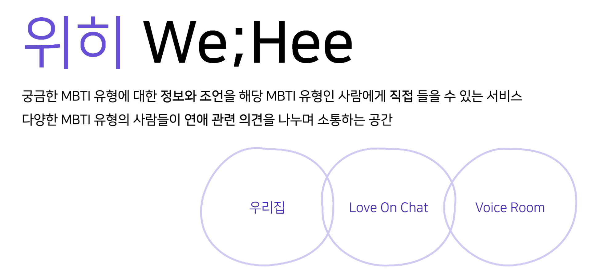
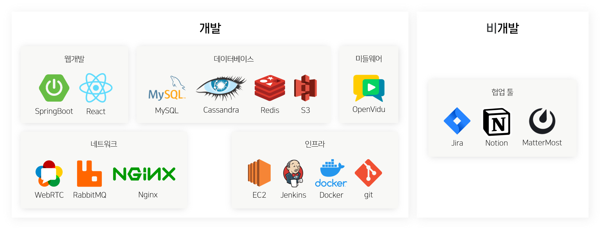
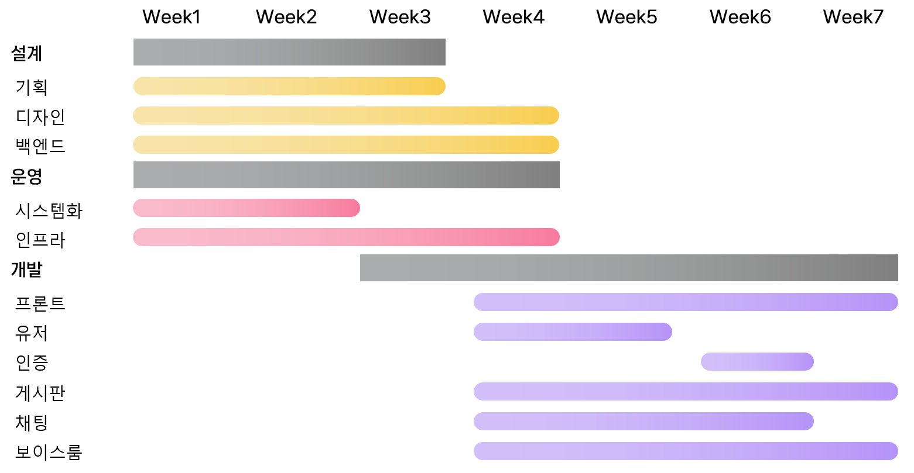

### QUICK LINKS

- [Notion](https://lemonade-log.notion.site/SSAFY-PJT-f8804bbfc7b24b1e91c25a4667a75e61?pvs=4)
- [Jira](https://ssafy.atlassian.net/jira/software/c/projects/S09P12A806/boards/3230)
- [Figma](https://www.figma.com/file/LOZntT4iuXmIPDn6SDdfK3/Main-Board?type=design&node-id=30-10&mode=design)
- [기술 문서](https://github.com/ItPizzaHere/WeHeeDocs/tree/main)

---

# 💜 WeHee - MBTI 기반 연애 소통 서비스 💜

---

## 목차

- [프로젝트 소개](#프로젝트-소개)
  - [주요 기능](#주요-기능)
  - [경쟁 서비스 분석](#경쟁-서비스-분석)
- [화면 설계서](#화면-설계서)
  - [우리집](#우리집)
  - [Love On Chat](#love-on-chat)
  - [Voice Room](#voice-room)
- [아키텍처](#아키텍처)
- [주요 기술](#주요-기술)
- [프로젝트 진행 기간](#프로젝트-진행-기간)
- [팀원](#팀원)

---

## 프로젝트 소개

### 주요 기능

1. **우리집**: 같은 MBTI 유형의 사람들이 일상, 연애 이야기를 공유하는 공간
2. **Love On Chat**: MBTI 유형을 지정해 연애 고민을 이야기하는 공간  
   연령대, 성별 필터로 더 최적화된 상대에게 조언을 듣는 공간
3. **Voice Room**: 모든 MBTI 유형이 음성으로 서로의 의견을 이야기하는 공간  
   카테고리에 구애받지 않고 자유롭게 토론하며 타 유형을 이해할 수 있음

### 경쟁 서비스 분석

|   조건\서비스    | MBTI 연애상담소 (네이버 프리미엄콘텐츠) | MBTI & Health (네이버 카페) | 블라인드 썸·연애 게시판 | 네이버 지식인 엑스퍼트 - 연애 |
| :--------------: | :------------------------------------------: | :------------------------------: | :--------------------------: | :--------------------------------: |
|       무료       |                      X                       |                O                 |              O               |                 X                  |
|      개방적      |                      X                       |                O                 |              O               |                 X                  |
| 전문가 개입 여부 |                      O                       |                X                 |              X               |                 O                  |
|  연애 중심 여부  |                      O                       |                X                 |              X               |                 X                  |
|  MBTI 활용 여부  |                      O                       |                O                 |              X               |                 X                  |

`WeHee = 무료 + 비개방적 + 동등한 사람들 + MBTI 활용 + 연애 중심`

---

## 화면 설계서

### 우리집

### Love On Chat

### Voice Room

---

## 아키텍처

---

## 주요 기술

---

## 프로젝트 진행 기간

`2023.07.10 ~ 2023.08.18 (약 7주)`

---

## 팀원

|                          김예진                          |                          류나연                           |                          박우현                           |                         유연정                         |                            윤석준                            |                         조명익                         |
| :------------------------------------------------------: | :-------------------------------------------------------: | :-------------------------------------------------------: | :----------------------------------------------------: | :----------------------------------------------------------: | :----------------------------------------------------: |
|  |  |  |  |  |  |
|         [Yejining](https://github.com/yejining)          |        [Nayeon Ryu](https://github.com/ryunayeon)         |        [WuHyun Park](https://github.com/138901146)        |       [Yu YeonJeong](https://github.com/yeonuy)        |     [seokjoonyoon55](https://github.com/seokjoonyoon55)      |          [ikjo93](https://github.com/ikjo93)           |
|                   팀장, 인증/채팅 구현                   |                   기획, 마이페이지 구현                   |                        우리집 구현                        |                   디자인, 프론트엔드                   |                    인프라, 보이스룸 구현                     |                         컨설팅                         |
